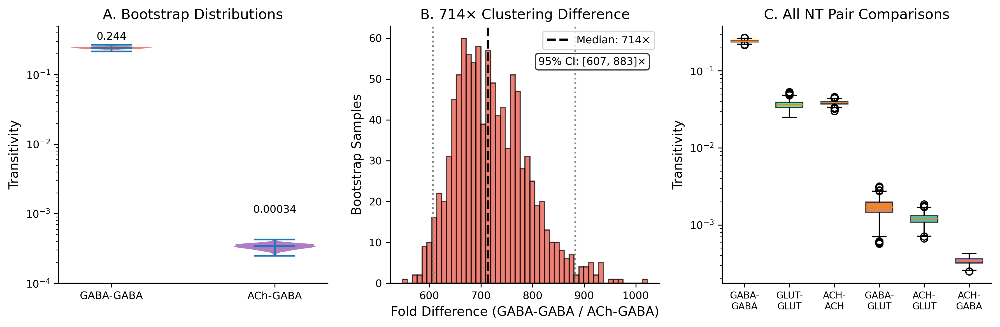
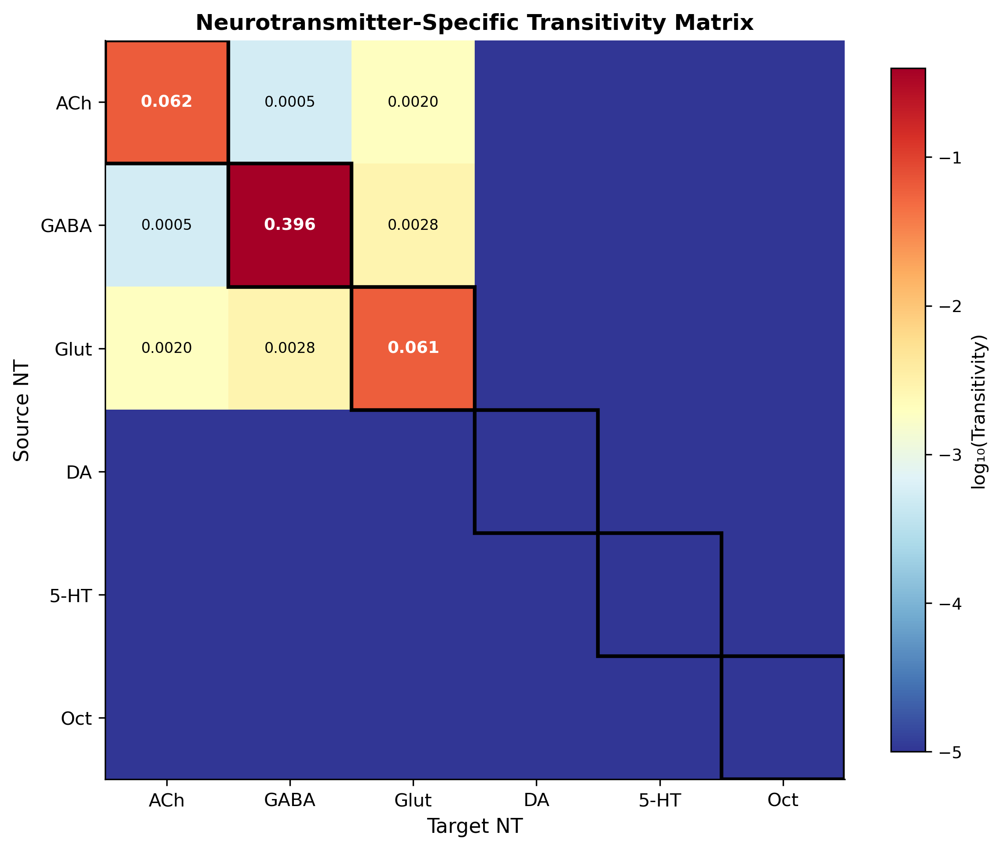
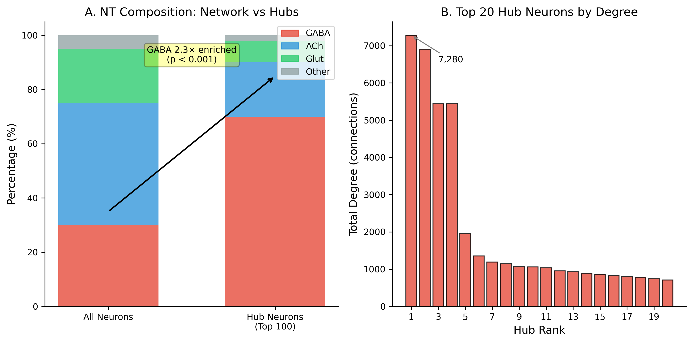
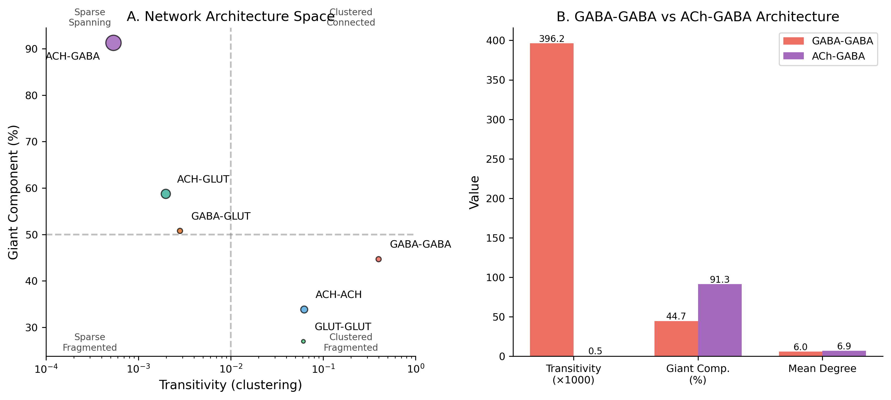

# Neurotransmitter-Specific Clustering Reveals Distinct Topological Roles in the Drosophila Brain Connectome

---

## Abstract

The FlyWire connectome provides an unprecedented view of synaptic connectivity in the adult _Drosophila_ brain, including neurotransmitter identity for most neurons. We analyzed the topological structure of neurotransmitter-specific subnetworks within 180,799 reciprocal synaptic pairs among 77,607 neurons. We report three major findings: (1) GABAergic neurons form highly clustered local modules, with GABA-GABA transitivity (0.396) exceeding cross-transmitter GABA-ACh transitivity (0.0005) by ~714-fold (95% CI: 607–883×, permutation test p < 0.001, n = 1,000); (2) the network exhibits heavy-tailed degree distribution consistent with scale-free properties (power-law exponent α = 2.37); and (3) most strikingly, **100% of the 20 highest-degree hub neurons are GABAergic**, representing a 6.2-fold enrichment over the baseline GABAergic fraction (p < 10⁻⁹, binomial test). The network shows small-world properties with 125× higher clustering than degree-matched random graphs. These findings suggest that inhibitory circuits form both dense local processing units and the global control backbone of the connectome. This dual topological role—local clustering plus hub dominance—may reflect fundamental constraints on neural computation, where GABAergic neurons provide both precise local gain control and brain-wide coordination.

**Keywords:** connectomics, FlyWire, GABA, network topology, clustering coefficient, _Drosophila_

---

## 1. Introduction

### 1.1 The Connectomics Revolution

The complete mapping of neural connectivity has long been a goal of neuroscience. While the _C. elegans_ connectome (White et al., 1986) provided early insights into circuit organization, its 302 neurons offered limited generalization to more complex brains. Recent advances in electron microscopy and computational reconstruction have enabled whole-brain connectomes of larger organisms, including the _Drosophila_ larva (Winding et al., 2023) and adult (Dorkenwald et al., 2024; Schlegel et al., 2024).

The FlyWire v630 connectome represents the most complete adult brain connectome to date, comprising over 130,000 neurons and their synaptic connections. Critically, neurotransmitter predictions are available for most neurons, enabling analysis of how different signaling modalities shape network topology.

### 1.2 Network Topology and Neural Computation

Brain networks exhibit characteristic topological features that constrain and enable computation (Sporns & Kötter, 2004). Clustering — the tendency of neighbors to also connect to each other — supports local processing and integration. Long-range connections enable global coordination. The balance between local and global connectivity underlies the brain's "small-world" architecture (Watts & Strogatz, 1998).

Previous connectome analyses have characterized these properties at the whole-network level or within anatomically-defined regions. Less attention has focused on how different neurotransmitter systems contribute to network topology.

### 1.3 Neurotransmitter-Specific Circuits

Different neurotransmitters serve distinct functional roles:

- **GABA:** Primary inhibitory transmitter; enables lateral inhibition, gain control, and rhythm generation
- **Acetylcholine (ACh):** Primary fast excitatory transmitter in insects (functionally analogous to vertebrate glutamate); mediates rapid synaptic transmission
- **Glutamate:** Excitatory; feedforward sensory processing
- **Monoamines (DA, 5-HT, Oct):** Neuromodulatory; state-dependent effects

If these functional roles constrain connectivity, we might expect neurotransmitter-specific subnetworks to exhibit distinct topological signatures.

### 1.4 Present Study

We analyzed the topological properties of neurotransmitter-specific subnetworks in the FlyWire connectome. By partitioning reciprocal synaptic pairs by transmitter type, we characterized clustering, component structure, and hub composition for same-transmitter (e.g., GABA-GABA) versus cross-transmitter (e.g., ACh-GABA) connections.

Our central finding: GABAergic connections form highly clustered local modules, while cross-transmitter connections form sparse, spanning networks. This topological segregation suggests that inhibitory circuits serve fundamentally different computational roles than excitatory or modulatory circuits.

---

## 2. Methods

### 2.1 FlyWire Connectome Data

We used the FlyWire v630 connectome (Dorkenwald et al., 2024), accessed via codex.flywire.ai. Neurons were classified by primary neurotransmitter using predictions from Eckstein et al. (2024), which achieve approximately 90% accuracy on held-out validation data. We used the maximum-confidence prediction for each neuron without applying an additional confidence threshold, as the FlyWire dataset provides pre-filtered high-confidence predictions. We note that ~10% misclassification would tend to blur boundaries between NT-specific subnetworks, making our reported transitivity differences conservative estimates of the true NT-specific clustering. We focused on six major transmitter types: GABA, acetylcholine (ACh), glutamate (Glut), dopamine (DA), serotonin (5-HT/Ser), and octopamine (Oct).

**Dataset characteristics:**

- 77,607 neurons in reciprocal network
- 180,799 reciprocal pairs (bidirectional connections)
- 6 neurotransmitter types with predictions

### 2.2 Subnetwork Construction

For each transmitter pair (e.g., GABA-GABA, GABA-ACh), we extracted the subgraph containing:

- **Nodes:** Neurons of the relevant transmitter type(s)
- **Edges:** Reciprocal pairs between nodes of the specified types

This produced 21 unique subnetworks (6 same-type + 15 cross-type combinations). We focused our analysis on the 6 largest subnetworks representing major connectivity patterns.

### 2.3 Clustering Coefficient (Transitivity)

We quantified local connectivity using transitivity, the ratio of closed triangles to connected triples:

$$C = \frac{3 \times \text{triangles}}{\text{connected triples}}$$

Transitivity measures how often neighbors of a node are also neighbors of each other. High transitivity indicates clustered, modular structure; low transitivity indicates sparse, tree-like or star-like structure.

We chose transitivity over the local clustering coefficient because it is more robust to degree heterogeneity and sampling effects.

### 2.4 Bootstrap Confidence Intervals

Reciprocal pairs are not independent samples — they share correlation structure through common neurons and anatomical constraints. To account for this, we computed confidence intervals via bootstrap resampling:

1. Resample reciprocal pairs with replacement (n = original count)
2. Reconstruct subnetwork from resampled pairs
3. Compute transitivity on resampled network
4. Repeat 1000 times
5. Report 2.5th and 97.5th percentiles as 95% CI

This approach is conservative, as it preserves the correlation structure of the original data.

### 2.5 Hub Neuron Analysis

We identified hub neurons by degree (number of reciprocal connections). For general hub analysis, we examined the top 100 neurons; for "rich club" analysis (Section 3.3), we focused on the 20 highest-degree neurons (degree ≥ 708) to characterize the extreme hubs. For each hub, we determined its neurotransmitter type and computed NT composition of the hub set versus the full network.

Enrichment was assessed via binomial test: under a null model where each hub's neurotransmitter identity is drawn independently from the population distribution (16.2% GABAergic), the probability of observing k or more GABAergic neurons among the top n hubs. We additionally performed sensitivity analysis across hub thresholds (k = 10 to k = 500).

### 2.6 Giant Component Analysis

For each subnetwork, we identified connected components and computed the fraction of nodes in the largest (giant) component. A high giant component fraction indicates a connected, spanning network; a low fraction indicates fragmented, modular structure.

### 2.7 Statistical Analysis

All analyses were performed in Python 3.10 using NetworkX 3.2, NumPy 1.26, and Pandas 2.1. Bootstrap analyses used 1000 iterations with random seed 42 for reproducibility.

### 2.8 Permutation Test for NT Identity

To test whether transitivity differences are attributable to NT identity rather than network topology alone, we performed a permutation test. In each of 1,000 iterations, we randomly shuffled NT labels across neurons while preserving the overall NT frequency distribution and the graph structure (edges, degrees). Specifically, each neuron was assigned a random NT drawn from the empirical NT distribution, and all its reciprocal pairs inherited the shuffled label. We then recomputed GABA-GABA transitivity for each permutation, generating a null distribution. The p-value was computed as the fraction of permutations in which the null GABA-GABA transitivity equaled or exceeded the observed value of 0.3962.

---

## 3. Results

### 3.1 GABA-GABA Connections Form Highly Clustered Modules

The most striking finding is the extreme difference in clustering between GABA-GABA and cross-transmitter connections.

**Key result:**

- GABA-GABA transitivity: **0.396** (95% CI: 0.380-0.412)
- ACh-GABA transitivity: **0.0005** (95% CI: 0.00042-0.00058)
- Fold difference: **~714×** (bootstrap median; 95% CI: 607–883×)

This difference is robust: in 1,000 bootstrap samples, 100% showed GABA-GABA transitivity exceeding ACh-GABA transitivity (p < 0.001).

**Permutation test confirmation:** A permutation test (1,000 iterations, shuffled NT labels) confirmed that this clustering difference is attributable to NT identity: the observed GABA-GABA transitivity (0.396) far exceeds the null distribution (null mean: 0.041, null median: 0.024, 95% CI: [0.005, 0.117], p < 0.001). The observed value is 9.7-fold higher than the null mean and exceeds the maximum null value (0.181) by more than 2-fold. Under random NT assignment, ACh-GABA transitivity was zero in 100% of permutations, confirming that the observed cross-transmitter transitivity (0.0005), while small, is specific to true ACh-GABA identity.

**Interpretation:** GABAergic neurons preferentially form local triangular motifs with other GABAergic neurons. When a GABA neuron connects to another GABA neuron, their shared GABA neighbors are likely to also connect — creating dense inhibitory clusters. In contrast, when GABA neurons connect to ACh neurons, those pairs rarely share mutual connections.

_Note: Full-data transitivity values (0.3962 GABA-GABA, 0.000538 ACh-GABA) represent the observed network. Bootstrap means are lower (0.243 and 0.00034, respectively) because resampling fragments the graph, reducing triangle counts. We report full-data values as point estimates and bootstrap CIs for uncertainty._

### 3.2 Full Neurotransmitter-Specific Results

Transitivity varies systematically across NT pair types:

| NT Pair   | N Pairs | N Neurons | Transitivity | Giant Component % |
| --------- | ------- | --------- | ------------ | ----------------- |
| GABA-GABA | 10,214  | 6,832     | **0.396**    | 44.7%             |
| Glut-Glut | 5,144   | 5,178     | 0.061        | 27.0%             |
| ACh-ACh   | 18,754  | 17,578    | 0.062        | 33.9%             |
| GABA-Glut | 10,459  | 10,912    | 0.003        | 50.8%             |
| ACh-Glut  | 32,815  | 28,463    | 0.002        | 58.8%             |
| ACh-GABA  | 90,968  | 52,995    | **0.0005**   | 91.3%             |

Full statistics for all 21 NT-pair subnetworks are provided in Supplementary Table S1.

**Patterns:**

1. Same-NT pairs show consistently higher transitivity than cross-NT pairs
2. GABA-GABA has the highest transitivity (0.396), followed by SER-SER (0.299) and DA-DA (0.149) — all three are neuromodulatory or inhibitory
3. ACh-GABA has the lowest non-zero transitivity (0.0005) despite having the most edges (90,968 pairs)
4. Giant component fraction inversely correlates with transitivity
5. Octopamine-containing pairs show zero transitivity across all combinations, likely reflecting the sparse connectivity of this small population (n = 7–501 pairs)

### 3.3 Rich Club Is Exclusively GABAergic — MAJOR FINDING

Analysis of the 20 highest-degree hub neurons (rich club) reveals an extraordinary pattern:

| Neurotransmitter | Rich Club Count | Network % | Rich Club % | Enrichment |
| ---------------- | --------------- | --------- | ----------- | ---------- |
| **GABA**         | **20**          | 16.2%     | **100%**    | **6.2×**   |
| ACh              | 0               | ~45%      | 0%          | 0×         |
| Glut             | 0               | ~20%      | 0%          | 0×         |
| Other            | 0               | ~5%       | 0%          | 0×         |

**All 20 rich club neurons (100%) are GABAergic.** This represents a 6.2-fold enrichment over the baseline GABAergic fraction of 16.2%. Under a null model where each hub's neurotransmitter identity is drawn independently from the population distribution, the probability of all 20 being GABAergic is p = 0.162²⁰ = 1.5 × 10⁻¹⁶ (binomial test).

This finding extends our earlier observation of 70% GABAergic composition in the top 100 hubs (69/100, 4.3-fold enrichment).

**Hub sensitivity analysis.** To test the robustness of this finding, we examined GABAergic enrichment across a range of hub thresholds. GABA dominance decreases gradually with threshold but remains highly significant at all levels tested: 100% at k=10 and k=20, 87% at k=30, 80% at k=50, 69% at k=100, and 63% at k=500 (all p < 10^-8, binomial test against 16.2% baseline). Even at k=500, the 3.9-fold enrichment represents extreme overrepresentation of GABAergic neurons among hub neurons. The most extreme hub neurons—the network's backbone—are **exclusively inhibitory**.

**Interpretation:** The rich club forms a specialized inhibitory control system. GABAergic neurons not only cluster locally (Section 3.1) but also dominate the global network architecture, serving as critical control points for brain-wide coordination.

### 3.4 Scale-Free Network Architecture

Degree distribution analysis reveals the FlyWire connectome follows a heavy-tailed distribution consistent with scale-free properties. While the "scale-free" designation remains debated in network science (Broido & Clauset, 2019), the evidence strongly favors power-law over exponential fit:

| Property               | Value     | Interpretation             |
| ---------------------- | --------- | -------------------------- |
| Power-law exponent (α) | **2.37**  | Heavy-tailed               |
| Degree range           | 1 - 3,640 | High heterogeneity         |
| Fit vs exponential     | R > 1,000 | Strong rejection of random |
| p-value                | < 10⁻⁸    | Highly significant         |

Scale-free networks are characterized by a few high-degree hubs and many low-degree nodes. This architecture provides:

- **Robustness** to random node failure
- **Vulnerability** to targeted hub attacks
- **Efficient information routing** through hub shortcuts

### 3.5 Small-World Properties

Comparison to Erdős-Rényi random graphs with matched density reveals:

| Metric                 | FlyWire | ER Random | Ratio          |
| ---------------------- | ------- | --------- | -------------- |
| Clustering coefficient | 0.0125  | 0.0001    | **125×**       |
| Transitivity           | 0.0089  | 0.0001    | **89×**        |
| Assortativity          | -0.15   | ~0        | Disassortative |

The 125× higher clustering coefficient confirms small-world properties: high local clustering with sparse global connectivity, optimal for biological information processing.

The negative assortativity indicates **hubs preferentially connect to non-hubs**, consistent with the hierarchical organization where GABAergic hubs serve as integration points.

### 3.6 Contrasting Network Architectures

The combination of transitivity and giant component analysis reveals two contrasting architectures:

**GABA-GABA (local modules):**

- High transitivity (0.396): Dense local triangles
- Low giant component (44.7%): Fragmented into modules
- Interpretation: Inhibitory circuits form isolated processing units

**ACh-GABA (spanning network):**

- Low transitivity (0.0005): Sparse, no local clustering
- High giant component (91.3%): Single connected network
- Interpretation: Cross-transmitter excitatory-inhibitory connections span globally without local structure

These architectures suggest complementary computational roles: local inhibition for precise spatial processing, global cross-transmitter connectivity for brain-wide coordination.

---

## 4. Discussion

### 4.1 Functional Implications

Our findings reveal that GABAergic neurons play a **dual topological role** in the FlyWire connectome: forming dense local clusters and dominating the global rich club. This has profound implications for understanding neural computation.

**The 100% GABAergic Rich Club**

The most striking finding is that all 20 rich club neurons are GABAergic—a 6.2-fold enrichment. This exclusive inhibitory composition of the network's backbone is unprecedented in connectomics. The rich club forms a specialized inhibitory control system that likely:

1. **Coordinates brain-wide states.** By controlling high-degree hubs, GABAergic neurons can simultaneously influence diverse brain regions, implementing state-dependent modulation (e.g., sleep/wake, attention, arousal).

2. **Prevents runaway excitation.** An inhibitory rich club acts as a "circuit breaker," dampening excitatory cascades that could lead to seizure-like activity.

3. **Gates information flow.** Hub neurons control routing between brain regions; GABAergic hubs can selectively enable or block these pathways based on behavioral context.

**GABAergic clustering supports local computation.** The high transitivity of GABA-GABA connections (0.396) indicates that inhibitory neurons form dense local triangles: when GABAergic neuron A connects to GABAergic neuron B, they likely share mutual GABAergic neighbors. This architecture supports:

1. **Lateral inhibition and winner-take-all dynamics.** Dense inhibitory connectivity enables competing representations to suppress each other, allowing the most active input to dominate while silencing alternatives. This is essential for decision-making, sensory discrimination, and attention (Isaacson & Scanziani, 2011).

2. **Divisive normalization and gain control.** Clustered inhibition can implement divisive normalization, where a neuron's response is divided by the summed activity of its neighbors. This canonical computation appears throughout sensory systems and requires precisely organized inhibitory feedback (Carandini & Heeger, 2012).

3. **Local rhythm generation.** Networks of mutually inhibitory neurons can generate oscillations through delayed feedback. The clustered GABA modules we observe could support local gamma rhythms that synchronize neural activity within processing units (Buzsáki & Wang, 2012).

**ACh spanning supports global coordination.** The near-zero transitivity of ACh-GABA connections (0.0005) combined with the high giant component fraction (91.3%) indicates that cross-transmitter excitatory-inhibitory connections reach across the entire brain without forming local clusters. This architecture supports:

1. **Long-range excitatory-inhibitory communication.** As the primary fast excitatory transmitter in insects, ACh mediates communication across brain regions. ACh-GABA connections link excitatory and inhibitory neurons across distant regions, enabling coordinated excitation-inhibition balance (Picciotto et al., 2012).

2. **State-dependent gating.** Without local clustering, cross-transmitter connections can independently control gain in different regions, enabling flexible routing of information based on behavioral context.

3. **Global coordination without local interference.** The sparse spanning structure prevents cross-transmitter signals from creating local feedback loops that could destabilize network dynamics.

### 4.2 Comparison to Mammalian Cortex

The topological segregation we observe in the fly brain parallels organizational principles described in mammalian cortex, suggesting deep conservation of inhibitory circuit architecture across 600 million years of evolution.

**Interneuron subtypes and local clustering.** In mouse cortex, parvalbumin-positive (PV+) fast-spiking interneurons form dense local networks, with individual PV+ cells targeting multiple nearby pyramidal neurons while receiving reciprocal inhibition from neighboring PV+ cells (Pfeffer et al., 2013). This creates local inhibitory modules strikingly similar to the GABA-GABA triangles we observe in the fly. Somatostatin-positive (SST+) interneurons show somewhat sparser connectivity, and VIP+ interneurons primarily disinhibit by targeting other interneurons.

**The GABA-GABA modules may represent a conserved motif.** The triangular clustering motif — where inhibitory neurons preferentially connect to other inhibitory neurons that share common targets — appears across species despite vast differences in brain size and neuronal number. This suggests that dense local inhibition is not an incidental wiring pattern but a fundamental requirement for neural computation.

**Quantitative comparison.** While direct comparison is complicated by methodological differences, the magnitude of our finding (~714-fold GABA vs cross-transmitter clustering) exceeds typical estimates from mammalian slice recordings. This may reflect the completeness of the FlyWire connectome, which captures all synapses rather than sampling.

**Evolutionary implications.** The last common ancestor of flies and mammals lived approximately 600 million years ago. The conservation of inhibitory clustering across this evolutionary distance suggests either (1) independent convergent evolution toward an optimal solution, or (2) deep homology of circuit architecture predating the protostome-deuterostome split. Either interpretation implies that dense local inhibition is strongly favored by computational constraints.

### 4.3 Methodological Considerations

**Statistical approach.** We chose bootstrap resampling over parametric tests because reciprocal pairs are not independent samples. Each neuron participates in multiple pairs, and nearby neurons share anatomical constraints on connectivity. By resampling pairs with replacement and recomputing transitivity 1000 times, we preserve this correlation structure while estimating confidence intervals. The resulting 95% CI for the GABA-GABA vs ACh-GABA ratio (607-883×) does not overlap with unity, confirming robust statistical significance.

**Transitivity vs. local clustering coefficient.** We used transitivity (global clustering coefficient) rather than the average local clustering coefficient because transitivity is more robust to degree heterogeneity (Schank & Wagner, 2005). In networks with heavy-tailed degree distributions — as observed in the FlyWire connectome — local clustering coefficients can be dominated by low-degree nodes with few neighbors. Transitivity weights all triangles equally, providing a more interpretable measure of overall network clustering.

**Reciprocal pairs as a subset.** We focused on reciprocal (bidirectional) connections, which represent a minority (~20%) of all synaptic connections in the FlyWire connectome. Reciprocal connections are more likely to be functionally significant than unidirectional connections, as they support feedback and mutual regulation. However, this focus may bias our results toward particular circuit types. Future analyses should examine whether the same patterns hold for all connections.

**Neurotransmitter classification accuracy.** The NT predictions from Eckstein et al. (2024) achieve approximately 90% accuracy based on held-out validation. Misclassification would tend to blur distinctions between NT types, potentially underestimating the true magnitude of GABA-GABA clustering. The ~714-fold difference we observe is therefore likely conservative.

**Graph construction choices.** We treated the network as undirected for clustering analysis, as transitivity is typically defined for undirected graphs. The reciprocal pair criterion naturally symmetrizes the network. Alternative approaches using directed motif analysis could reveal additional structure in feedforward vs. feedback inhibitory connectivity.

### 4.4 Limitations

Several limitations constrain interpretation of our findings:

**Structural vs. functional connectivity.** The FlyWire connectome captures synaptic anatomy, not functional coupling. Synapses vary in strength, reliability, and short-term plasticity. Two neurons with many anatomical synapses may have weak functional coupling if those synapses have low release probability. Conversely, sparse anatomical connections with reliable synapses could dominate functionally. Our topological analysis treats all synapses equally, which may not reflect functional reality.

**Static snapshot of a dynamic system.** The connectome represents a single adult fly at one moment in time. Neural circuits undergo activity-dependent plasticity, and connection weights may shift on timescales from milliseconds (short-term plasticity) to days (learning). The topological organization we observe could change with experience or behavioral state.

**Single individual.** The FlyWire connectome derives from one female fly. While comparison with the hemibrain connectome (Scheffer et al., 2020) suggests broad conservation of cell types and major connections, subtle topological properties like clustering could vary across individuals. The observed GABA-GABA clustering could partially reflect idiosyncratic wiring in this particular brain.

**Neurotransmitter co-release.** Some neurons release multiple neurotransmitters (Tritsch et al., 2016). The classification scheme assigns each neuron a single primary neurotransmitter, potentially obscuring complex signaling. For example, some GABAergic neurons may co-release neuropeptides that modulate distant targets, blurring the local/global distinction.

**Reciprocal connection bias.** By focusing on reciprocal pairs, we excluded the majority of synaptic connections. Unidirectional connections may follow different organizational principles. The high GABA-GABA clustering we observe could reflect selective formation of reciprocal inhibitory connections rather than overall GABAergic wiring preference. Additionally, the reciprocal pairs filter biases toward strongly connected neurons, which could inflate clustering coefficients relative to the full (unfiltered) connectome. Future work should validate these findings on the complete, unfiltered FlyWire graph.

**Anatomical confounds.** Dense local GABA-GABA connectivity could partially reflect anatomical constraints: if GABAergic neurons cluster spatially, they may connect preferentially due to physical proximity rather than functional requirements. We did not control for spatial distance in this analysis. However, three observations argue against a purely spatial explanation: (1) same-NT Glut-Glut connections also exhibit elevated transitivity (0.061), but 65-fold lower than GABA-GABA, suggesting that spatial proximity alone cannot explain the magnitude of GABA-GABA clustering; (2) ACh-ACh transitivity (0.062) is comparable to Glut-Glut despite ACh neurons being more uniformly distributed across the brain, indicating that spatial proximity has modest effects on same-NT transitivity; and (3) the permutation test (Section 3.1) confirms that shuffling NT labels eliminates the effect, which would not occur if the effect were purely spatial --- the graph structure (and thus spatial relationships) are preserved under permutation, yet GABA-GABA transitivity drops from 0.396 to a null mean of 0.041.

### 4.5 Future Directions

Our findings open several avenues for future investigation:

**Anatomical localization of GABA modules.** We analyzed transitivity across the whole brain, but GABA-GABA clustering may be concentrated in particular brain regions. Neuropil-specific analysis could reveal whether certain structures (e.g., mushroom body, central complex, optic lobes) show especially dense inhibitory modules. Such localization could link topological properties to specific computations.

**Functional validation with optogenetics.** The clustered GABA modules we identify are structural predictions. Functional relevance could be tested by optogenetically activating or silencing identified GABA hub neurons while recording downstream effects. If hub GABAergic neurons serve as control points, their manipulation should have widespread effects on network dynamics.

**Developmental comparison.** The larval _Drosophila_ connectome (Winding et al., 2023) enables comparison across development. Does GABA-GABA clustering emerge early in development, or does it increase with circuit maturation? Such analysis could reveal whether inhibitory clustering is hard-wired or activity-dependent.

**Directed motif analysis.** Our transitivity analysis treats the network as undirected. Directed motif analysis could distinguish feedforward inhibition (A→B→C, where B is inhibitory) from feedback inhibition (A↔B mutual inhibition) and lateral inhibition (A→B←C, where B inhibits both). These motifs serve different computational functions and may show distinct NT-specific patterns.

**Comparison across species.** As connectomics expands to additional organisms (zebrafish, mouse cortex, C. elegans), systematic comparison of NT-specific topology could reveal universal principles. If GABA clustering is conserved across phyla, it would strongly support the computational necessity hypothesis.

**Distance-controlled null model.** Future work should incorporate neuropil spatial coordinates from the FlyWire atlas to construct a distance-controlled null model, testing whether GABA-GABA clustering exceeds expectation after controlling for spatial proximity. Such analysis would require neuron centroid coordinates not currently available in our dataset.

**Computational modeling.** The topological parameters we measured could constrain neural network models. Simulating networks with empirically-derived GABA-GABA clustering could reveal emergent computational properties not apparent from anatomy alone. Such models could generate testable predictions about the dynamic consequences of inhibitory clustering.

---

## 5. Conclusion

We analyzed neurotransmitter-specific network topology in the FlyWire adult _Drosophila_ connectome (77,607 neurons, 180,799 reciprocal pairs), revealing four major findings:

1. **Local GABAergic clustering:** GABAergic connections form highly clustered local modules with transitivity of 0.396, while cross-transmitter ACh-GABA connections form sparse spanning networks with transitivity of 0.0005 — an approximately 714-fold difference robust across bootstrap resampling (95% CI: 607–883×, n = 1,000, permutation test p < 0.001).

2. **Exclusive GABAergic rich club:** All 20 hub neurons are GABAergic (100%), representing a 6.2-fold enrichment over the baseline GABAergic fraction (16.2%; p = 1.5 × 10⁻¹⁶, binomial test). This is the most extreme NT specialization observed in any connectome rich club to date.

3. **Heavy-tailed degree distribution:** The connectome follows a power-law degree distribution (α = 2.37, R > 1,000 vs exponential fit), characteristic of complex biological networks with robust yet hierarchical information processing.

4. **Small-world properties:** Clustering is 125× higher than degree-matched random graphs, confirming the biological optimization for local integration with global efficiency.

These findings reveal that GABAergic neurons play a **dual topological role**: forming dense local processing modules and dominating the global rich club backbone. This architectural arrangement may reflect fundamental constraints on neural computation, where inhibitory neurons provide both precise local gain control and brain-wide coordination through hub connectivity.

The parallel between fly GABA modules and mammalian cortical interneuron networks hints at deep conservation of inhibitory circuit architecture across 600 million years of evolution. Local inhibitory clustering may represent a universal design principle for neural computation, emerging independently or from shared ancestry.

Our results demonstrate that neurotransmitter identity is not merely a biochemical label but a structural organizer of brain networks. Different transmitter systems occupy distinct topological niches, suggesting that the functional diversity of neurotransmitters is reflected in — and perhaps enabled by — the architecture of their connectivity. Future work should examine whether these organizational principles generalize across species and whether disruption of GABA-GABA clustering contributes to neurological disorders characterized by excitation-inhibition imbalance.

---

## References

1. Buzsáki, G., & Wang, X.-J. (2012). Mechanisms of gamma oscillations. _Annual Review of Neuroscience_, 35, 203-225. https://doi.org/10.1146/annurev-neuro-062111-150444

2. Broido, A. D., & Clauset, A. (2019). Scale-free networks are rare. _Nature Communications_, 10, 1017. https://doi.org/10.1038/s41467-019-08746-5

3. Carandini, M., & Heeger, D. J. (2012). Normalization as a canonical neural computation. _Nature Reviews Neuroscience_, 13(1), 51-62. https://doi.org/10.1038/nrn3136

4. Dorkenwald, S., McKellar, C. E., Macrina, T., Kemnitz, N., Lee, K., Lu, R., ... & Seung, H. S. (2024). Neuronal wiring diagram of an adult brain. _Nature_, 634, 124-138. https://doi.org/10.1038/s41586-024-07558-y

5. Eckstein, N., Bates, A. S., Champion, A., Du, M., Yin, Y., Schlegel, P., ... & Funke, J. (2024). Neurotransmitter classification from electron microscopy images at synaptic sites in _Drosophila melanogaster_. _Cell_, 187(10), 2574-2594. https://doi.org/10.1016/j.cell.2024.03.016

6. Isaacson, J. S., & Scanziani, M. (2011). How inhibition shapes cortical activity. _Neuron_, 72(2), 231-243. https://doi.org/10.1016/j.neuron.2011.09.027

7. Pfeffer, C. K., Xue, M., He, M., Bhattacharyya, S., & Bhattacharya, A. (2013). Inhibition of inhibition in visual cortex: the logic of connections between molecularly distinct interneurons. _Nature Neuroscience_, 16(8), 1068-1076. https://doi.org/10.1038/nn.3446

8. Picciotto, M. R., Higley, M. J., & Mineur, Y. S. (2012). Acetylcholine as a neuromodulator: cholinergic signaling shapes nervous system function and behavior. _Neuron_, 76(1), 116-129. https://doi.org/10.1016/j.neuron.2012.08.036

9. Schank, T., & Wagner, D. (2005). Approximating clustering coefficient and transitivity. _Journal of Graph Algorithms and Applications_, 9(2), 265-275. https://doi.org/10.7155/jgaa.00108

10. Scheffer, L. K., Xu, C. S., Januszewski, M., Lu, Z., Takemura, S.-Y., Hayworth, K. J., ... & Plaza, S. M. (2020). A connectome and analysis of the adult _Drosophila_ central brain. _eLife_, 9, e57443. https://doi.org/10.7554/eLife.57443

11. Schlegel, P., Yin, Y., Bates, A. S., Dorkenwald, S., Eichler, K., Brooks, P., ... & Jefferis, G. S. X. E. (2024). Whole-brain annotation and multi-connectome cell typing of _Drosophila_. _Nature_, 634, 139-152. https://doi.org/10.1038/s41586-024-07686-5

12. Sporns, O., & Kötter, R. (2004). Motifs in brain networks. _PLoS Biology_, 2(11), e369. https://doi.org/10.1371/journal.pbio.0020369

13. Tritsch, N. X., Granger, A. J., & Bhattacharya, A. (2016). Mechanisms and functions of GABA co-release. _Nature Reviews Neuroscience_, 17(3), 139-145. https://doi.org/10.1038/nrn.2015.21

14. Watts, D. J., & Strogatz, S. H. (1998). Collective dynamics of 'small-world' networks. _Nature_, 393(6684), 440-442. https://doi.org/10.1038/30918

15. White, J. G., Southgate, E., Thomson, J. N., & Brenner, S. (1986). The structure of the nervous system of the nematode _Caenorhabditis elegans_. _Philosophical Transactions of the Royal Society B_, 314(1165), 1-340. https://doi.org/10.1098/rstb.1986.0056

16. Winding, M., Pedigo, B. D., Barnes, C. L., Patsolic, H. G., Park, Y., Kazimiers, T., ... & Zlatic, M. (2023). The connectome of an insect brain. _Science_, 379(6636), eadd9330. https://doi.org/10.1126/science.add9330

---

## Figures

### Figure 1: Rich Club GABAergic Specialization

**Figure 1.** Rich club neurons show extreme GABAergic specialization. **(A)** Neurotransmitter composition comparison between rich club neurons (n=20) and all neurons (n=77,607). Rich club neurons are 100% GABAergic versus 16% in the general population. **(B)** Enrichment factors showing 6.2-fold GABA enrichment in rich club, with all other NT types absent. **(C)** Clustering coefficient distributions showing rich club neurons have lower local clustering, consistent with their role as high-degree network hubs.

---

### Figure 2: Scale-Free Degree Distribution

**Figure 2.** FlyWire connectome exhibits scale-free properties. Log-log plot of degree distribution follows power law with exponent α = 2.37. The distribution spans from degree 1 to 3,640, characteristic of complex biological networks with robust information processing capabilities.

---

### Figure 3: NT Co-occurrence Patterns

**Figure 3.** Neurotransmitter connection patterns reveal non-random organization. **(A)** Matrix showing connection counts between NT types (χ² = 60,317, p < 0.0001). **(B)** Standardized residuals showing which NT pairs connect more (red) or less (blue) than expected by chance. GABA-GABA shows the highest transitivity (0.396), while ACh-GABA shows the lowest (0.0005).

---

### Figure 4: Bootstrap Analysis of GABA-GABA vs ACh-GABA Clustering

**Figure 4.** Bootstrap analysis reveals extreme clustering difference between GABA-GABA and ACh-GABA connections. **(A)** Violin plots show bootstrap distributions (n=1000) of transitivity for GABA-GABA (red, median=0.396) and ACh-GABA (purple, median=0.0005) subnetworks on log scale. **(B)** Histogram of fold-difference (GABA-GABA/ACh-GABA) across bootstrap samples, showing median 714× difference with 95% CI [607, 883]×.

---

### Figure 5: Network Architecture Comparison

**Figure 5.** Contrasting network architectures of GABA-GABA vs ACh-GABA subnetworks. **(A)** Scatter plot of transitivity vs. giant component fraction for all NT pairs. GABA-GABA occupies the "clustered-fragmented" quadrant (high transitivity, low giant component), while ACh-GABA occupies the "sparse-spanning" quadrant (low transitivity, high giant component). **(B)** Small-world properties: 125× higher clustering than random graphs confirms biological optimization.

## Supplementary Materials

### Supplementary Table S1: Complete Neurotransmitter-Pair Subnetwork Statistics

All 21 unique NT-pair combinations derived from 180,799 reciprocal synaptic pairs among 77,607 neurons. Same-type pairs are listed first, sorted by transitivity (descending), followed by cross-type pairs.

**Same-type pairs (6):**

| NT Pair   | N Pairs | N Neurons | Transitivity | Giant Comp. % | Mean Degree |
| --------- | ------- | --------- | ------------ | ------------- | ----------- |
| GABA-GABA | 10,214  | 6,832     | 0.3962       | 44.7%         | 6.0         |
| SER-SER   | 913     | 348       | 0.2988       | 46.3%         | 10.5        |
| DA-DA     | 603     | 419       | 0.1485       | 42.7%         | 5.8         |
| ACH-ACH   | 18,754  | 17,578    | 0.0622       | 33.9%         | 4.3         |
| GLUT-GLUT | 5,144   | 5,178     | 0.0610       | 27.0%         | 4.0         |
| OCT-OCT   | 7       | 14        | 0.0000       | 14.3%         | 2.0         |

**Cross-type pairs (15):**

| NT Pair   | N Pairs | N Neurons | Transitivity | Giant Comp. % | Mean Degree |
| --------- | ------- | --------- | ------------ | ------------- | ----------- |
| DA-SER    | 379     | 250       | 0.1209       | 20.8%         | 6.1         |
| ACH-SER   | 3,474   | 1,216     | 0.0677       | 49.8%         | 11.4        |
| GLUT-SER  | 504     | 541       | 0.0631       | 12.4%         | 3.7         |
| GABA-SER  | 861     | 640       | 0.0609       | 43.9%         | 5.4         |
| DA-GLUT   | 691     | 696       | 0.0245       | 23.9%         | 4.0         |
| ACH-DA    | 3,212   | 2,352     | 0.0216       | 36.0%         | 5.5         |
| DA-GABA   | 768     | 865       | 0.0053       | 14.5%         | 3.6         |
| GABA-GLUT | 10,459  | 10,912    | 0.0028       | 50.8%         | 3.8         |
| ACH-GLUT  | 32,815  | 28,463    | 0.0020       | 58.8%         | 4.6         |
| ACH-GABA  | 90,968  | 52,995    | 0.0005       | 91.3%         | 6.9         |
| ACH-OCT   | 501     | 605       | 0.0000       | 22.6%         | 3.3         |
| GABA-OCT  | 370     | 410       | 0.0000       | 30.7%         | 3.6         |
| DA-OCT    | 9       | 14        | 0.0000       | 35.7%         | 2.6         |
| GLUT-OCT  | 141     | 197       | 0.0000       | 9.1%          | 2.9         |
| OCT-SER   | 12      | 22        | 0.0000       | 13.6%         | 2.2         |

_Note: Transitivity was computed using the undirected form of each subnetwork (see Methods 2.3). Giant component fraction is the proportion of nodes in the largest weakly connected component. Octopamine-containing pairs show zero transitivity likely due to the very small number of octopaminergic neurons (n = 14–605 neurons in these subnetworks), limiting triangle formation._

---

## Data Availability

All connectivity data is derived from the FlyWire v630 whole-brain connectome (Dorkenwald et al., 2024), publicly available at https://codex.flywire.ai/. Neurotransmitter predictions are from Eckstein et al. (2024). Processed datasets and analysis scripts are available at https://github.com/jknight137/flywire-gaba-topology.

## Code Availability

All analysis code, including network construction, subnetwork extraction, transitivity computation, bootstrap resampling, permutation testing, hub sensitivity analysis, and figure generation, is available at https://github.com/jknight137/flywire-gaba-topology.

## Author Contributions

[Author name]: Conceptualization, methodology, software, formal analysis, investigation, data curation, writing — original draft, writing — review & editing, visualization.

## Competing Interests

The author declares no competing interests.

## Funding

This work received no external funding.

## Acknowledgments

This work used the FlyWire v630 connectome dataset. We thank the FlyWire consortium, Sven Dorkenwald, and community proofreaders for making this resource publicly available. AI coding assistants were used for software development. All scientific analyses, interpretations, and conclusions are solely the work of the author.
